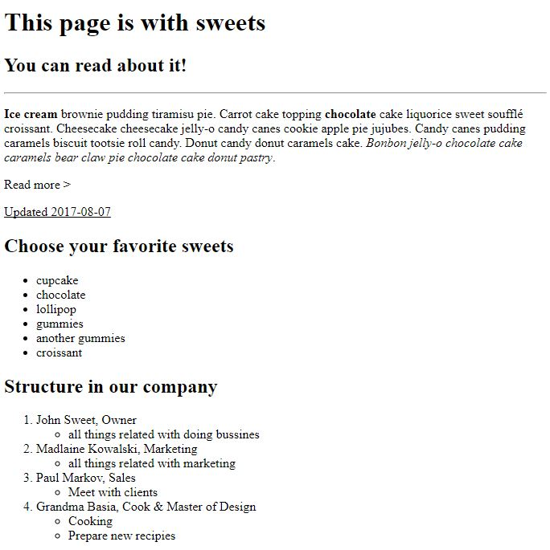

# HTML &ndash; formatowanie tekstu

Na podstawie znanych elementów html spróbuj stworzyć identyczną strukturę w **index.html**.

 

 ## Ważne
 W pierwszym akapicie nie nadużywaj znacznika przełamania linii **br**. Zauważ, że w edytorze Word nie wstawiasz znaku enter na końcu każdego wiersza. W kodzie html też pozwól na swobodne przelewanie się tekstu w ramach paragrafu (akapitu).

&#8222;Read more &gt;&#8221; powinno zaczynać się od nowego paragrafu.

 Wróć do slajdu &#8222;Zagnieżdżanie list&#8221; w prezentacji o HTML i CSS oraz poczytaj na ten temat w [dokumentacji][dokumentacja]. Zwróć uwagę, w jakim miejscu umieszcza się listę zagnieżdżoną, zwłaszcza gdzie zamyka się znacznik **li**.

 Nie zwracaj uwagi na typ znacznika w liście zagnieżdżonej. Nie ma znaczenia, czy poszczególne elementy zaczynają się od symbolu koła, okrągu czy kwadratu. Ważne, aby to była lista nieuporządkowana (**ul**).

## Potrzebujesz pomocy?
* [Generator tekstu (do 1. akapitu)](http://www.cupcakeipsum.com)
* [Dokumentacja, paragraf ](https://developer.mozilla.org/pl/docs/Web/HTML/Element/p)
* [Dokumentacja, lista zagnieżdżona](https://developer.mozilla.org/pl/docs/Web/HTML/Element/ul)
* HTML i CSS &ndash; prework

<!-- links -->
[dokumentacja]: https://developer.mozilla.org/pl/docs/Web/HTML/Element/ul
